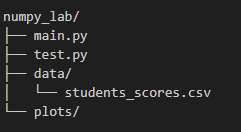
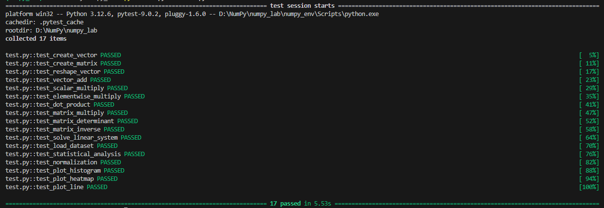

# Laboratory Work 2

!!! info "Lab Info"
    | | |
    |---|---|
    | 🗓️ **Date**   | 07/03/2026|
    | 👨‍💻 **Author** | Chu Ngoc Truong |
    | 🐙 **GitHub** | [View source code](https://github.com/ngoctruong22/ngoctruong22.github.io/tree/main/numpy_lab) |

---

## 🎯 Objective
Цель лабораторной работы — изучить библиотеку NumPy для численных вычислений и анализа данных.  
Я должен научиться работать с массивами, выполнять векторные и матричные операции, делать простой статистический анализ и строить графики.

---

## 📋 Task Description

<!-- Mô tả đề bài / yêu cầu của lab -->
В этой лабораторной работе нужно реализовать несколько функций с использованием библиотеки NumPy.  

Основные задачи:

- создать и изменять массивы NumPy  
- выполнять векторные операции (сложение, умножение, скалярное произведение)  
- выполнять матричные операции (умножение матриц, определитель, обратная матрица)  
- решить систему линейных уравнений  
- загрузить данные из CSV файла  
- выполнить простой статистический анализ данных  
- нормализовать данные  
- построить графики с помощью matplotlib и seaborn  

Все функции должны проходить автоматические тесты с использованием `pytest`.

---

## 💡 Solution

<!-- Trình bày hướng giải quyết, thuật toán, hoặc cách tiếp cận -->
Я доработал функции, описанные в файле руководства, используя имеющиеся данные, и протестировал их с помощью pytest.
Примечание: Вам необходимо создать виртуальную среду и загрузить необходимые библиотеки.
1. Создайте виртуальное окружение:
  python -m venv numpy_env
   
2. Активируйте виртуальное окружение:
  - Windows: numpy_env\Scripts\activate
  - Linux/Mac: source numpy_env/bin/activate
   
3. Установите зависимости:
  pip install numpy matplotlib seaborn pandas pytest

---

## 💻 Code

Подробности кода можно посмотреть здесь: [View code](https://github.com/ngoctruong22/ngoctruong22.github.io/tree/main/numpy_lab)

---

## 📊 Results

<!-- Kết quả chạy chương trình, ảnh chụp màn hình, hoặc output -->

---

## 📝 Conclusion

<!-- Nhận xét, rút ra bài học sau khi hoàn thành lab -->
+ Я узнал:

1. создание и обработка массивов
2. векторные операции
3. матричные операции
4. статистический анализ
5. визуализация
---

[← Back to Lab 1](lab1.md){ .md-button }
[Lab 3 →](lab3.md){ .md-button .md-button--primary }

