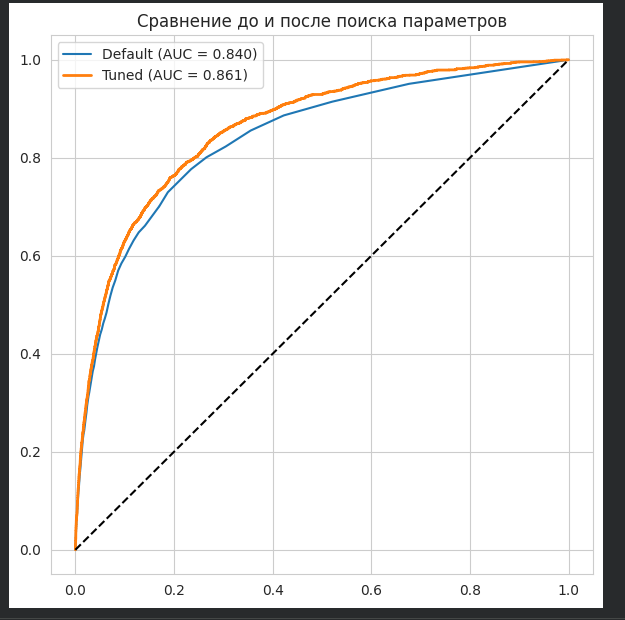

# Laboratory Work 4

!!! info "Lab Info"
    | | |
    |---|---|
    | 🗓️ **Date**   | 04/04/2026|
    | 👨‍💻 **Author** | Chu Ngoc Truong |
    | 🐙 **Colab** | [Link to Colab](https://colab.research.google.com/drive/1IoacSXGx8l_T--IsveWZVt37rgGRl-FO?usp=sharing) |

---

## 🎯 Objective
Цель данной лабораторной работы — изучить методы классификации с использованием библиотеки Scikit-Learn, а также научиться обучать модели, оценивать их качество и сравнивать различные алгоритмы.

---

## 📋 Task Description

<!-- Mô tả đề bài / yêu cầu của lab -->
1. Сделайте копию борда s2p1-predict-credit-default-tasks, получив собственный ноутбук с помощью сервиса Google Colab или локально.
2. Заполните пропуски в борде, дополнив кодом ячейки с соответствующим комментарием.
3. Самостоятельная работа: исследуйте другие модели для реализации классификации значений. Постарайтесь построить более точную модель, модель, имеющую ошибку, меньшую чем в рассматриваемых в борде (например, SVM, kNN). При невозможности получить более точную модель, используйте LLM инструменты для того чтобы это сделать (альтернативно: опишите с помощью LLM, почему это сделать невозможно). 
4. Изучите какие алгоритмы классификации используются сейчас, проанализировав научные публикации по теме и/или соответствующие исследования в kaggle (например, вот такое). 
5. Исследуйте (опционально с помощью LLM) каким образом обученную модель можно интегрировать с веб-сервисом, реализованным с помощью веб-фреймворка Flask / Django / FastAPI и опишите тезисно пошаговый алгоритм, что необходимо для этого сделать.
6. Представить отчет на сайте портфолио в виде ссылки на собственный ipynb-борд с заполненными ячейчками и самостоятельным заданием.
7. Убедиться в том, что доступ к нему открыт (проверка — открытие в режиме инкогнито).

---

## 💡 Solution

<!-- Trình bày hướng giải quyết, thuật toán, hoặc cách tiếp cận -->
Решение было выполнено по следующему pipeline:

1. **Загрузка данных**  
   Данные были загружены и проанализированы.

2. **Предобработка**  
   - Обработка пропущенных значений  
   - Кодирование категориальных признаков  

3. **Разделение данных**  
   Данные были разделены на обучающую и тестовую выборки (80/20).

4. **Масштабирование**  
   Использовался StandardScaler, особенно важно для алгоритма kNN.

5. **Обучение моделей**
   Были обучены следующие модели:
   - Logistic Regression    
   - Random Forest  

6. **Оценка качества**
   Использовались метрики:
   - Accuracy  
   - ROC-AUC  

7. **Улучшение модели**
   Для Random Forest были подобраны параметры (n_estimators, max_depth), что позволило повысить качество модели.

---

## 💻 Code
[Link to Colab](https://colab.research.google.com/drive/1IoacSXGx8l_T--IsveWZVt37rgGRl-FO?usp=sharing)

---

## 📊 Results

<!-- Kết quả chạy chương trình, ảnh chụp màn hình, hoặc output -->

- Более подробные результаты представлены в моем Colab.

## 📝 Conclusion

<!-- Nhận xét, rút ra bài học sau khi hoàn thành lab -->
Кроме того, гиперпараметры модели случайного леса были точно настроены, но не достигли значения ROC-AUC ≥ 0,9 по различным причинам, наиболее значимыми из которых были связаны с набором данных.

---

[← Back to Lab 3](lab3.md){ .md-button }
[Lab 5 →](lab5.md){ .md-button .md-button--primary }

