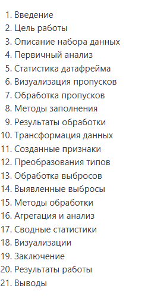

# Laboratory Work 6

!!! info "Lab Info"
    | | |
    |---|---|
    | 🗓️ **Date**   | 17/04/2026|
    | 👨‍💻 **Author** | Chu Ngoc Truong |
    | 🐙 **Colab** | [Link to Colab](https://colab.research.google.com/drive/1h8QscxXtqcvKAM8IdC0ZMheCz1QW19Ng?usp=sharing) |

---

## 🎯 Objective
Цель работы Освоение методов очистки и трансформации данных с использованием библиотеки pandas на примере реальных данных из Kaggle.

---

## 📋 Task Description

<!-- Mô tả đề bài / yêu cầu của lab -->
В данной работе используется датасет Titanic, содержащий информацию о пассажирах корабля.

Задача — предсказать, выжил ли пассажир (**Survived**) на основе его характеристик:

- пол (Sex)
- возраст (Age)
- класс билета (Pclass)
- стоимость билета (Fare)
- и другие признаки

Необходимо:

- выполнить анализ данных;
- обработать пропуски;
- закодировать категориальные признаки;
- обучить модель классификации;
- оценить качество модели.

---

## 💡 Solution

<!-- Trình bày hướng giải quyết, thuật toán, hoặc cách tiếp cận -->
Решение было выполнено по следующему pipeline:

---

## 💻 Code
[Link to Colab](https://colab.research.google.com/drive/1h8QscxXtqcvKAM8IdC0ZMheCz1QW19Ng?usp=sharing)

---

## 📊 Results

<!-- Kết quả chạy chương trình, ảnh chụp màn hình, hoặc output -->
Анализ коэффициента Крамера показал, что существует сильная зависимость между признаками Survived и Sex, что подтверждает влияние пола на выживаемость. Связь между признаками Survived и IsAlone является слабой, а между Sex и IsAlone — умеренной.

- Более подробные результаты представлены в моем Colab.

## 📝 Conclusion

<!-- Nhận xét, rút ra bài học sau khi hoàn thành lab -->
Очистка данных является важнейшим этапом анализа.
Использование методов обработки пропусков и выбросов позволяет улучшить качество данных.
Создание новых признаков помогает выявить скрытые зависимости в данных.
Дополнительно было установлено, что признак Sex является одним из самых важных факторов, влияющих на выживаемость пассажиров.

---

[← Back to Lab 3](lab3.md){ .md-button }
[Lab 5 →](lab5.md){ .md-button .md-button--primary }

