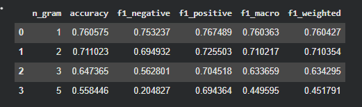

# Laboratory Work 7

!!! info "Lab Info"
    | | |
    |---|---|
    | 🗓️ **Date**   | 17/04/2026|
    | 👨‍💻 **Author** | Chu Ngoc Truong |
    | 🐙 **Colab** | [Link to Colab](https://colab.research.google.com/drive/114cCyvafLSW0vtQ90qcMGaFbuWp8BDZJ?usp=sharing) |

---

## 🎯 Objective
Раньше мы смотрели на светлую сторону анализа данных - построение моделей. Теперь попробуем глубже посмотреть на часть про предобработку данных. Задача предобработки особенно актуальна, если мы имеем дело с текстами.

---

## 📋 Task Description

<!-- Mô tả đề bài / yêu cầu của lab -->
Сделайте копию борда борда, получив собственный ноутбук с помощью сервиса Google Colab. 
Открыть доступ, отобразить в верхней ячейке фамилию, имя и группу. 
Заполните пропуски в борде, дополнив кодом ячейки с соответствующим комментарием (комментарий TODO). 
Выполните самостоятельную работу, опубликованную в борде колаба.
Оставить ссылку на блокнот в колабе в качестве ответа. Ссылка должна быть ссылкой, т. е. кликабельна. 

---

## 💡 Solution

<!-- Trình bày hướng giải quyết, thuật toán, hoặc cách tiếp cận -->
Решение было выполнено по Colab.
Самостоятельная работа:
1. Изучите материал, представленный в борде.
2. Выполните все ячейки и получите результаты.
3. Приведите результаты таблицы classification_report в под этим заданием для модели LogisticRegression
4. Примените 2 альтернативных использованному алгоритму для решения задачи классификации (для примера XGBClassifier и еще какой-то один) и получите результаты в таблице classification_report
5. Для XGBClassifier вам потребуется задать параметры
```learning_rate=0.1, n_estimators=1000, max_depth=5, min_child_weight=3, gamma=0.2, subsample=0.6, colsample_bytree=1.0, objective='binary:logistic', nthread=4, scale_pos_weight=1, seed=27```

6. В разделе TF-IDF векторизация по аналогии с униграммами и пентаграммами вычислите classification_report для биграмм, триграмм опубликуйте результаты в отчете и укажите изменилась ли точность f1-score при их использовании по сравнению с униграммами и пентаграммами.

---

## 💻 Code
[Link to Colab](https://colab.research.google.com/drive/114cCyvafLSW0vtQ90qcMGaFbuWp8BDZJ?usp=sharing)

---

## 📊 Results

<!-- Kết quả chạy chương trình, ảnh chụp màn hình, hoặc output -->
- Более подробные результаты представлены в моем Colab.


---

## 📝 Conclusion

<!-- Nhận xét, rút ra bài học sau khi hoàn thành lab -->
В ходе экспериментов было установлено, что наилучшие результаты достигаются при использовании униграмм. При переходе к биграммам качество модели немного снижается, а при использовании триграмм и пентаграмм наблюдается значительное ухудшение метрик. Это связано с увеличением размерности признакового пространства и разреженностью данных. Таким образом, увеличение n-грамм не всегда приводит к улучшению качества модели, особенно для коротких текстов.

---

<div style="display: flex; justify-content: space-between; margin-top: 2rem;" markdown>
[← Back to Lab 6](lab6.md){ .md-button }
[Lab 8 →](lab8.md){ .md-button .md-button--primary }
</div>