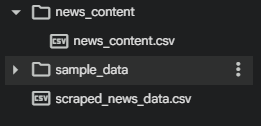

# Laboratory Work 8

!!! info "Lab Info"
    | | |
    |---|---|
    | 🗓️ **Date**   | 02/05/2026|
    | 👨‍💻 **Author** | Chu Ngoc Truong |
    | 🐙 **Colab** | [Link to Colab](https://colab.research.google.com/drive/1fcWY9z-qcQYhaHaGO5uOCvJksyqI5hH8?usp=sharing) |

---

## 🎯 Objective
Освоение методов скрапинга данных из веб-страниц.

---

## 📋 Task Description

<!-- Mô tả đề bài / yêu cầu của lab -->
Скрапинг и анализ текста (P3123)
1. Сделайте копию борда борда, получив собственный ноутбук с помощью сервиса Google Colab. 
2. Открыть доступ, отобразить в верхней ячейке фамилию, имя и группу. 
3. Спарсить 
- Идентификатор новости (целочисленное число из URL)
- Название новости
- Дата её размещения
- URL на страницу с конкретной новостью.
4. Для каждой новости в датасете спарсить:
- Идентификатор
- Название новости
- Дата размещения
- Количество просмотров
- Текст (не забыть про вариативность верстки)
- Теги
5. Сохранить данные из пункта 4 в csv-файле (или файлах) в папке (news_content) рядом с csv с общими данными (из пункта 3)
В качестве ответа предоставить ссылку на колаб-файл (предварительно выполнить все ячейки и сделать "Сохранить и закрепить версию".

---

## 💡 Solution

<!-- Trình bày hướng giải quyết, thuật toán, hoặc cách tiếp cận -->
Решение было выполнено по Colab

---

## 💻 Code
[Link to Colab](https://colab.research.google.com/drive/1fcWY9z-qcQYhaHaGO5uOCvJksyqI5hH8?usp=sharing)

---

## 📊 Results

<!-- Kết quả chạy chương trình, ảnh chụp màn hình, hoặc output -->

| Файл | Описание |
|---|---|
| `scraped_news_data.csv` | Основная информация о новостях |
| `news_content/news_content.csv` | Подробные данные: просмотры, текст, теги |
[Открыть результаты](https://drive.google.com/drive/folders/1gyf44QyyYS8yMBEyZi3a3J8nFVnKvUso)

## 📝 Conclusion

<!-- Nhận xét, rút ra bài học sau khi hoàn thành lab -->
В ходе выполнения лабораторной работы был реализован процесс скрапинга новостных данных с сайта ITMO. Были собраны основные сведения о новостях, такие как идентификатор, название, дата размещения и ссылка, а также дополнительная информация для каждой новости: текст, количество просмотров и теги.

Полученные данные были успешно сохранены в CSV-файлы, что позволяет использовать их для дальнейшего анализа. В процессе работы были изучены принципы анализа HTML-структуры страницы, выбора корректных селекторов и обработки возможных ошибок при парсинге.

Основной сложностью стало определение корректных HTML-элементов, так как структура страниц может отличаться (например, использование тегов 
 или <time> для даты). 

---

[← Back to Lab 7](lab7.md){ .md-button }
[Lab 9 →](lab9.md){ .md-button .md-button--primary }

