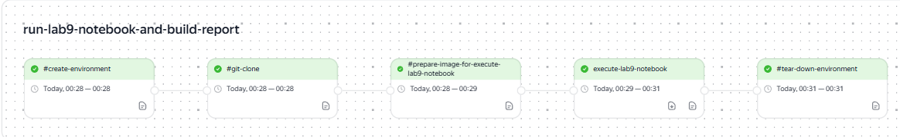

# Laboratory Work 6

!!! info "Lab Info"
    | | |
    |---|---|
    | 🗓️ **Date**   | 17/04/2026|
    | 👨‍💻 **Author** | Chu Ngoc Truong |
    | 🐙 **Colab** | [Link to SourceCraft](https://sourcecraft.dev/ngoctruong22/portfolio22/browse/lab9/lab_template.ipynb?rev=main) |

---

## 🎯 Objective
Работа с графикой. Sourcecraft. CI/CD. Артефакты

---

## 📋 Task Description

<!-- Mô tả đề bài / yêu cầu của lab -->
- Требования к оформлению notebook
- Требования к CI/CD

---

## 💡 Solution

<!-- Trình bày hướng giải quyết, thuật toán, hoặc cách tiếp cận -->

---

## 💻 Code
yaml
---
  lab9-check:
    tasks:
      - name: run-lab9-notebook-and-build-report
        cubes:
          - name: execute-lab9-notebook
            image: docker.io/library/python:3.11
            script:
              - pip install jupyter nbconvert pandas numpy matplotlib
              - jupyter nbconvert --to notebook --execute lab9/lab_template.ipynb --output executed_lab.ipynb
              - jupyter nbconvert --to html executed_lab.ipynb --output report.html
            artifacts:
              paths:
                - executed_lab.ipynb
                - report.html
---

---

## 📊 Results

<!-- Kết quả chạy chương trình, ảnh chụp màn hình, hoặc output -->

[Link to Sourcecraft](https://sourcecraft.dev/ngoctruong22/portfolio22/browse/lab9/lab_template.ipynb?rev=main)

## 📝 Conclusion

<!-- Nhận xét, rút ra bài học sau khi hoàn thành lab -->
В ходе работы был выполнен анализ данных об успеваемости студентов с использованием библиотек pandas и matplotlib. Были проведены этапы загрузки, обработки данных, создания новых признаков, а также группировки и визуализации.
Анализ показал, что прохождение подготовительного курса положительно влияет на результаты студентов. Также было выявлено, что студенты женского пола в среднем показывают немного более высокие результаты. Кроме того, наблюдается зависимость между уровнем образования родителей и успеваемостью: чем выше уровень образования, тем выше средний балл.
Также была обнаружена положительная связь между результатами по различным предметам, что говорит о комплексном уровне подготовки студентов.
В процессе работы особых трудностей не возникло, однако требовалось внимательно обрабатывать данные и корректно интерпретировать результаты визуализации.

---

[← Back to Lab 8](lab8.md){ .md-button }
[Lab 10 →](lab10.md){ .md-button .md-button--primary }

